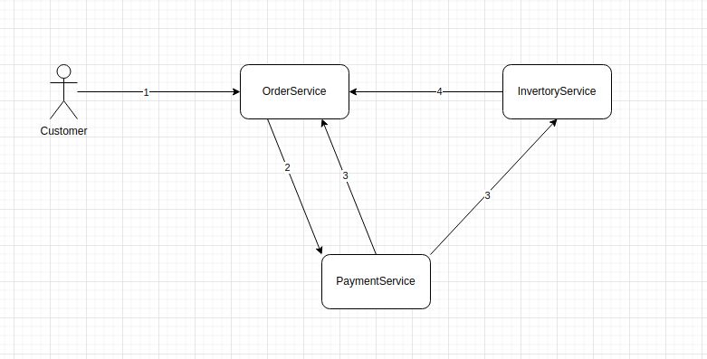

# saga_pattern_demo

The Saga pattern is a widely used pattern for distributed transactions. This project aims to rethink the Saga pattern. As an example of a purchase action, we followed the Saga pattern and built a system that simulates what happens when an order is created.

Project description

Creating a purchase order
When a message is passed to a payment service and an inventory service, the two services perform separate functions and return results regardless of whether the order was successfully completed or not.
Special points

Ensure data consistency (by managing transactions) between different microservices.
Solve actual purchase problems

